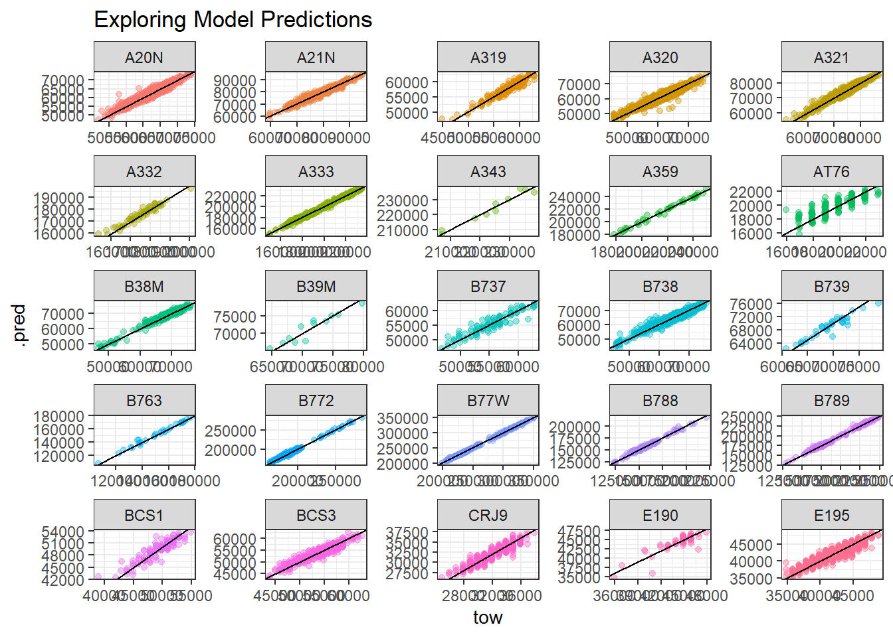

## Intro

This is a repo attempting a solution in Eurocontrol/OpenSkyNetwork's PRC TOW challenge.

`data/` contains data input for the model.
`features_from_trajectories` contains some feature generaiton from the ADS-B trajectories.
`notebooks` contains some Rmarkdown notebooks.

The final model chosen is a LightGBM trained by running `lightgbm_hyperparam_tuning.R`.

The `predict.R` loads the saved final model and generates the predictions.

## Some Discussion on the final Model:

Generally, error was much larger with heavier aircraft…

The model has learned to predict between MTOW and empty weight well as well… The A321 and 767 MTOWS are probably wrong (I pinched them off Wikipedia)

### What features did the model choose?
It's actually quite possible to build a decent lightweight model (around 3,000 RMSE) without the trajectories at all.

### Bottom Line
The rationale for challenge was to see how often aircraft operate close to their MTOW. We can use our model to infer this.

Put another way, if you fly B772’s, you almost always fly at 60% of MTOW, so paying fees based on MTOW is a bad deal.
