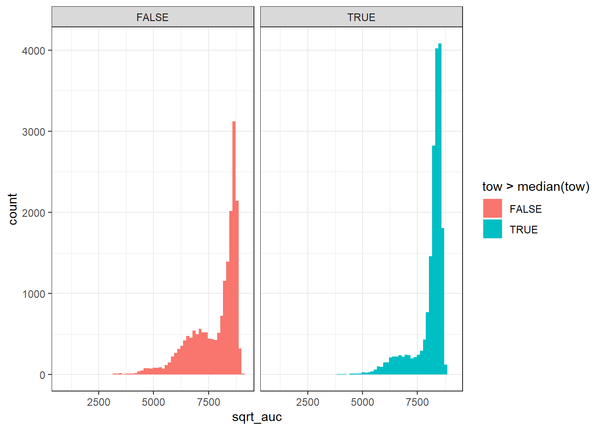
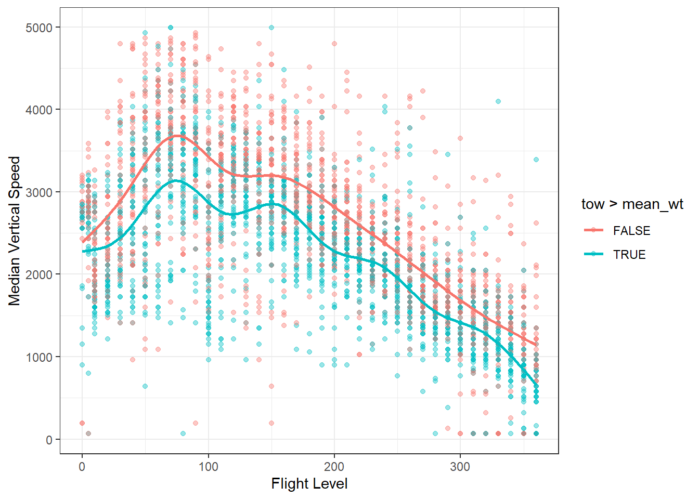
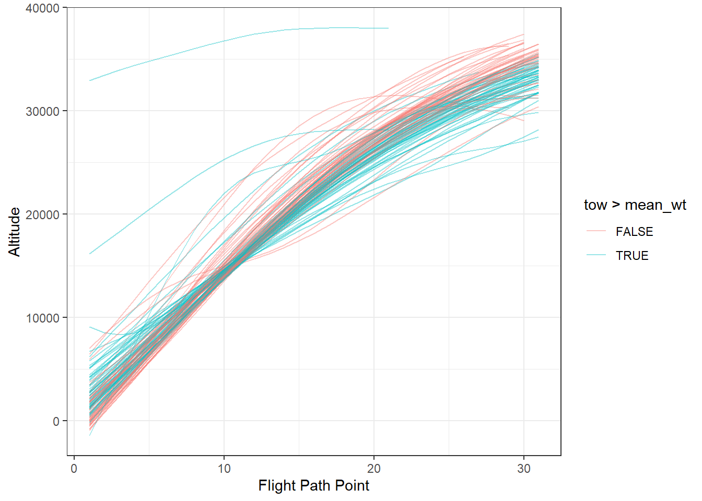

## Creating Features

Contains 3 R scripts that generate the required features from the trajectory data. 

Only R dependencies required are `tidyverse` for data wrangling, `nanoparquet` and `pillar` to read the parquet data.

`generate_flightlevel_stats.R` and `smooth_params.R` are vectorised and process at a reasonable pace. `extract_vertical_features.R` is much slower. Apart from that the process is relatively the same: point the script to the relevant directory with the downloaded parquets and run the loop.

A full rmarkdown explainer on the features is available in `Notes-on-Features.html`, but broadly, there are three types.

## An AUC feature

Treats the climb portion as a line on a graph and calculates the area under the curve.

## VS and TAS at each FL checkpoint
Losely based on the BADA model, where key metrics are calculated at subsequent flight level points:

## Granular Climb Trajectories
Loosely inspired by Alligier (2015) and based on the idea that machine learning could benefit from the raw climb data itself, this approach fits a spline to account for noisy data points, and looks a set number of points (based on 30 second increments) before and after a flight reaches a threshold (in practice I used 15,000 feet)
